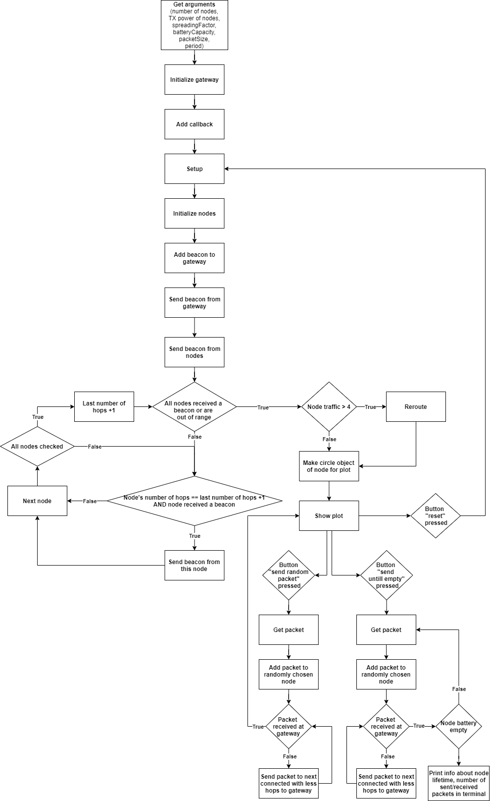

# LoRa Mesh Simulation
LoRaSimSODAQ.py is the file for our main simulation.

A LoRa mesh simulation program, commissioned by SODAQ. This program is made in
order to evaluate the power consumption network architecture, extra range with
mesh topology and amount of throughput.

## Table of contents
* [Installation](#Installation)
* [Usage](#Usage)
* [Arguments](#Arguments)
* [Interactivity](#Interactivity)
* [Flowchart](#Flowchart)
* [Licensing](#Licensing)

## Installation:
Firstly make sure required packages are installed by executing following line
in a command prompt, while in the directory of simulation file:
`pip install -r requirements.txt`

## Usage:
`python3 ./LoRaSimSODAQ.py <numberOfNodes> <TXpower> <spreadingFactor> <batteryCapacity> <packetSize> <period> <setupUntilTrafficIs>`

## Arguments:
#### numberOfNodes
* Input any number of nodes to be simulated.
#### TXpower
* A value between -2 and 20 dBm. This value is the transmission power
  with which every node will be sending packets.
#### spreadingFactor
* A value between 7 and 12. This value will be the spreadingFactor
  with which every packet will be sent.
#### batteryCapacity
* Any value in mAh. This is the battery capacity every node will get.
#### packetSize
* A value between 1 and 255. Payload of all the to be sent packets in bytes.
#### period
* Any value in minutes. This is the interval at which all the nodes will
  be sending packets.
  If left 0 nodes will be transmitting as fast as possible.
#### setupUntilTrafficIs
* A value between 0 and numberOfNodes. Sets the simulation up until
  one of the nodes' traffic is equal to this value.
  If left 0 setup will be done just once.

## Interactivity:
There are 3 buttons in the simulation:
* Send untill empty
  when pressed: Packets will be assigned to random nodes and forwarded to
                the gateway until one of the nodes is empty.
* Reset
  when pressed: Resets whole program and shows new plot.
* Random packet
  when pressed: Packet will be assigned to random node and forwarded to
                the gateway.

The nodes and gateway inside the plot can be clicked on to show some information
about them in the console.

## Flowchart

#####Licensing
Copyright (c) 2021 S.E.C. Vergouwen

Permission is hereby granted, free of charge, to any person obtaining a copy
of this software and associated documentation files (the "Software"), to deal
in the Software without restriction, including without limitation the rights
to use, copy, modify, merge, publish, distribute, sublicense, and/or sell
copies of the Software, and to permit persons to whom the Software is
furnished to do so, subject to the following conditions:
The above copyright notice and this permission notice shall be included in all
copies or substantial portions of the Software.
THE SOFTWARE IS PROVIDED "AS IS", WITHOUT WARRANTY OF ANY KIND, EXPRESS OR
IMPLIED, INCLUDING BUT NOT LIMITED TO THE WARRANTIES OF MERCHANTABILITY,
FITNESS FOR A PARTICULAR PURPOSE AND NONINFRINGEMENT. IN NO EVENT SHALL THE
AUTHORS OR COPYRIGHT HOLDERS BE LIABLE FOR ANY CLAIM, DAMAGES OR OTHER
LIABILITY, WHETHER IN AN ACTION OF CONTRACT, TORT OR OTHERWISE, ARISING FROM,
OUT OF OR IN CONNECTION WITH THE SOFTWARE OR THE USE OR OTHER DEALINGS IN THE
SOFTWARE.

